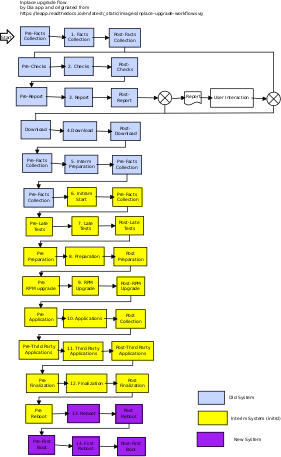

# Rocky Linux Beginner Docs Style Guide

## Intro

Beginner documentation is for, you guessed it, beginners! This is the documentation where you can go a little wild, writing-wise. Feel free to use metaphors and analogies to help newbie sysadmins learn the basic concepts of installing Rocky Linux and managing their system.

This content in particular is something that we want to feel welcoming, and non-threatening. That stage of learning where everything is new and a potential headache is a fragile time. It's far too easy to lose people who look at a tutorial and think, "Wow. I am *never* going to get that.

When listing prerequisites, don't forget to link to our other guides, to make sure that beginner readers have a strong foundation in what they need to know.

----

# Beginner Docs Example

Rocky Linux Install - Step-by-Step

## Prerequisites

* A computer to install to, with a recommended hard drive size of 8GB or more. Note that as far as this documentation is concerned, we assume you are using the entire computer hard drive for Rocky Linux.
* A spare USB flash drive or other USB device that can be used only for the installation (no other files on the drive).
* An Internet connection for the initial download, and updates once the installation is complete.
* Knowledge of how to create a bootable USB drive
* Knowledge of the target machine's method for booting to another device. This is typically done by a key pressed during the POST. You may have to do a little research on your machine's motherboard or BIOS in order to get this information, but a simple Google search will probably get you what you need.

## Install Steps

Once the prerequisites have been met:

1. Download a copy of Rocky Linux (ISO) from here:  [https://rocky-linux.org/download](https://rocky-linux.org/download)
2. Check the key prior to the installation to make sure your download is correct  
`gpg --keyserver-options auto-key-retrieve --verify rocky-linux-1.0-x86_64.iso.sig`
3. Write the Rocky Linux image (ISO) to your USB device. Refer back to your research for your particular Operating System.
4. Once the ISO has been written to the USB device, you can attach it to the machine that you will be installing Rocky Linux on and boot to this device. Again, refer to the prerequisites (above) to do this.
5. If you successfully boot to the Rocky Linux image, you should be looking at a Rocky Linux splash screen giving you installation options.  
`insert screen shot here`
6. If you are using the entire drive of your target machine for Rocky Linux, the easiest way to get up and running is to simply take the default installation option.
`insert screen shot`
7. Choose your language preference on the first screen and click "Continue"  
`insert screen shot`
8. On the next screen, choose your Time Zone, Keyboard, etc. This will also be where you select something other than the default install options, if you are looking for something besides a desktop (in other words, a server install w/o graphical interface, for example). You can make changes to the installed packages by getting into the "Software Selection" section. You will also want to enable the Network interface that you are using.  
`insert screen shot`  
When you've made all of the changes that you wish to make here, click "Begin Installation".
9. You will be presented with a splash screen for setting the password for root and adding a user.
`insert screen shot`  
You can do this as the installation progresses. It is required that you have a root password, and highly recommended that you also create a non-root user and password.
10. Once the installation is complete, follow the on-screen instructions to reboot the machine. You should now have a working Rocky Linux installation.

# Inplace upgrade workflow

.